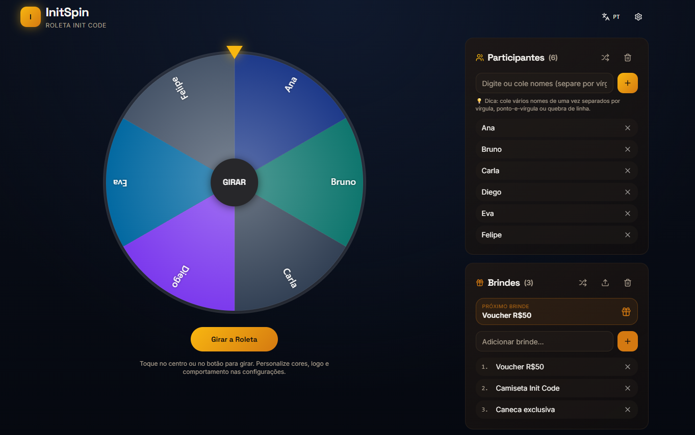
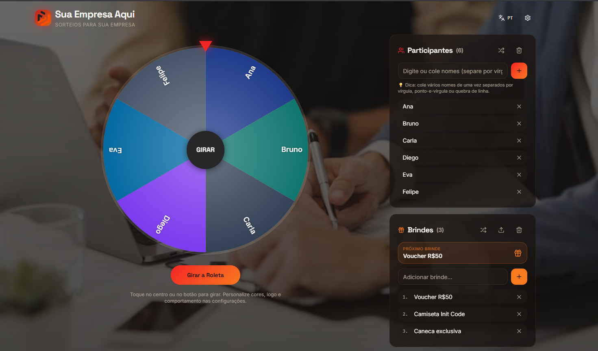
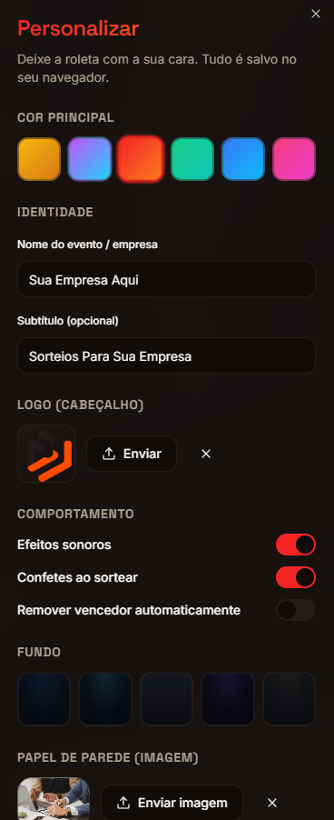
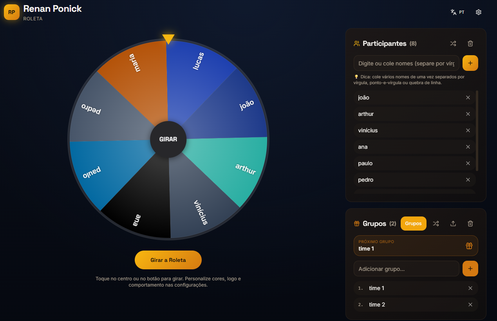
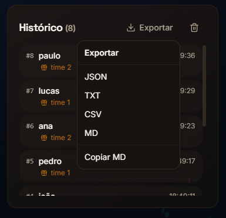

# Roleta Gratuita

Roleta de gratuita

Acesse: https://roleta.initcode.com.br/



Várias possibilidades para customizar a roleta:





Opção para sortear grupos disponível, dessa forma fica fácil separar o trabalho em grupo na escola, ou as equipes em um jogo de futeba.



Preocupado com salvar o histórico dos sorteios ou exportar? Relaxa, pensei nisso também!


A que eu mais gosto é copiar para MD, fica assim ó:

```md
# Relatório de grupos

- time 1: arthur, vinícius, pedro, lucas
- time 2: maria, joão, ana, paulo
```
